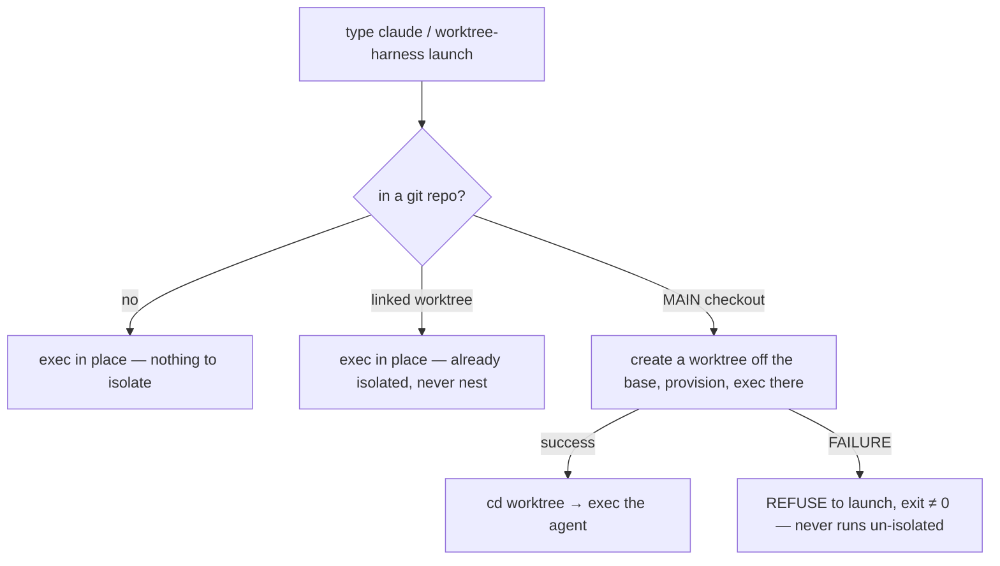
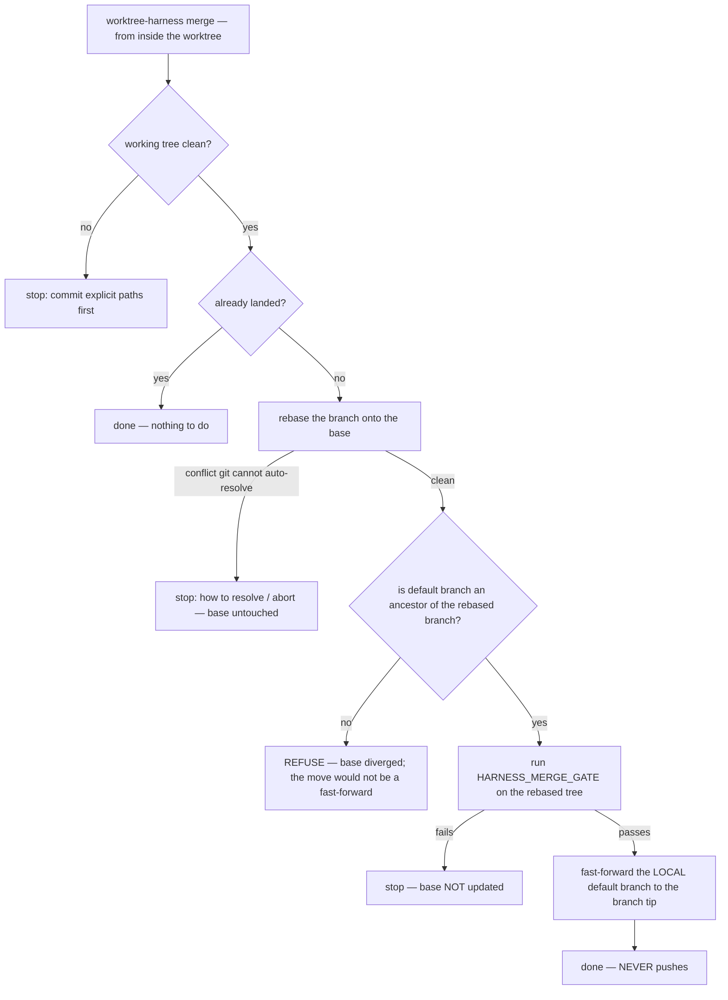

# worktree-harness

**Run many coding agents in parallel — each in its own git worktree, each fast-forwarded back to your default branch safely — with nothing on your machine but `git` and `bash`.** Claude Code, Aider, Codex, whatever; the worktrees don't care.

[](https://github.com/renchris/worktree-harness/actions/workflows/ci.yml)


▶ **[Watch the interactive player](https://renchris.github.io/worktree-harness/)** — crisp, selectable-text playback (asciinema).

```console
$ worktree-harness new add-auth
→ fetch origin main
→ git worktree add ~/.worktrees/myapp/add-auth -b add-auth origin/main
✓ copied 1 gitignored file(s)
→ install: pnpm install --frozen-lockfile
✓ ports offset by 1 → ~/.worktrees/myapp/add-auth/.harness.env
✓ worktree ready: ~/.worktrees/myapp/add-auth  (branch: add-auth)

# ...work in the worktree, commit, then:
$ worktree-harness merge        # rebase onto main, run your gate, fast-forward main. never pushes.
$ worktree-harness gc --prune   # reap merged + idle worktrees (your branches are kept)
```

Three agents, three branches, three clean fast-forwards onto your local `main` — and nothing pushed until you say so:

```
 time ──────────────────────────────────────────────────────►
 add-auth:   new·edit·commit──merge───────────────────────gc
 fix-123:        new·edit·commit────────merge─────────────gc
 refactor:           new·edit·commit──────────────merge───gc

 main:              A───────────B───────────────────C────►
                    ▲           ▲                    ▲
               ff-only      ff-only              ff-only      (never pushes)
```

---

## Running parallel agents on one checkout breaks in five specific ways

You're running more than one coding agent at once — Claude Code in one pane, Aider in another — against the same repo. On a single shared checkout, five concrete things go wrong:

- **One git index, shared.** One session's `git add -A` (or an agent committing "all changes") sweeps another session's half-staged work into the wrong commit.
- **Ports collide.** Two dev servers want `:3000`; two inspectors want `:9229`.
- **A fresh worktree won't run.** `git worktree add` gives you a tree with no `.env`, no `node_modules`, no local DB — it won't start without hand-wiring.
- **Landing the branch back is where the damage happens.** A non-fast-forward clobber of `main`, a "looked merged but never typechecked" regression, or an accidental push to a stale remote.
- **Existing tooling assumes `origin` is canonical** and silently no-ops on non-GitHub remotes — wrong for the solo / diverged-fork workflow where your *local* branch is the truth.

The fix is one idea — **give each session its own git worktree** — and four disciplines that follow from it. Each worktree has its own index, HEAD, and reflog, so the collision isn't *coordinated away*, it's *impossible*. `worktree-harness` is the small, dependency-free glue that makes that worktree runnable and safe to land — and nothing more.

## Isolation is structural, not cooperative

Each session gets its own worktree at `~/.worktrees/<repo>/<branch>`, with its own index, HEAD, and reflog, all backed by the one shared object store. The staged-file collision isn't prevented by a lock — there is no shared staging area to collide on, so it cannot happen.

```
 you, in N panes        (type `claude`, or `worktree-harness launch claude`)
 ┌───────────┬───────────┬───────────┐
 │  pane 1   │  pane 2   │  pane 3   │
 └─────┬─────┴─────┬─────┴─────┬─────┘
       │           │           │   from the MAIN checkout (.git is a dir) → isolate
       ▼           ▼           ▼
 ┌───────────┬───────────┬───────────┐
 │  wt: A    │  wt: B    │  wt: C    │  separate working tree
 │ branch A  │ branch B  │ branch C  │  separate index · HEAD · reflog
 │ base:main │ base:main │ base:main │  branched off the base at creation
 │ own ports │ own ports │ own ports │  .env copied · deps installed · .harness.env
 └─────┬─────┴─────┬─────┴─────┬─────┘
       └───────────┼───────────┘
                   ▼
        one shared  <repo>/.git    (objects + refs; content-addressed, atomic)
        refs/heads/{ main, A, B, C }
```

That is why there is **no lock and no daemon**. The only shared mutable thing left is `refs/heads/*`, and git already serializes ref updates with a per-ref lock held for microseconds. (An earlier version of this idea carried a session-long writer lock; it blocked other sessions for zero safety benefit — the worktrees had already removed the collision it guarded — so it was deleted.)

The launcher follows the same principle: from your main checkout it isolates *before* running your agent, and if it can't, it **refuses to launch** rather than run un-isolated.



A guard that silently does nothing when it fails is worse than no guard, because you *think* you're protected. Isolation here fails closed: no worktree, no launch (`WH_ISOLATION_SKIP=1` opts out explicitly).

## A fresh worktree arrives runnable

`git worktree add` hands you an empty tree; `new` makes it actually work, in the order you'd do it by hand:

- **Copies your gitignored state** — the files you declare in `HARNESS_COPY` (`.env`, `.env.local`, …), with `chmod 0600` on anything matching `*.env*` so secrets aren't world-readable.
- **Runs the frozen-lockfile install** for your package manager, auto-detected from the lockfile: pnpm, npm, yarn (classic + berry), bun, uv, poetry, pipenv, pip, cargo, go.
- **Assigns non-colliding ports** by offset and writes them to `<worktree>/.harness.env` — `source` it and your dev server and inspector won't fight the other worktrees.
- **Runs your setup** — whatever you put in `HARNESS_SETUP` (e.g. `pnpm db:setup`).

`new` prints the worktree path on **stdout** (everything else is stderr), so you can capture it: `wt="$(worktree-harness new feat)"`.

## Landing back is fast-forward-only, gated, and never pushed

`merge`, run from inside the worktree, makes the one boring, safe move:



Three properties are deliberate:

1. **Fast-forward only.** The branch is rebased onto the base, then an ancestry check confirms the move is a true fast-forward before anything is touched. A diverged base is refused loudly, not forced.
2. **Gated.** A clean *textual* rebase can still be *semantically* broken, so `HARNESS_MERGE_GATE` (your typecheck/test command) runs on the rebased tree *before* the default branch moves — catching breakage a plain merge would hide.
3. **Never pushes.** Landing is local; pushing stays a separate, explicit `git push` you run when you mean it. (This is a direct answer to a real footgun in a popular alternative, whose "checkout" auto-pushes to the remote.)

Concurrent merge-backs serialize naturally — each is a fast-forward of one ref, ordered by git's per-ref lock in microseconds; a non-fast-forward is rejected, so the loser of a race just re-rebases and retries. Cleanup is conservative by construction: `gc` removes a worktree only if it's merged **and** clean **and** idle **and** not open by a live process — anything else is kept with a printed reason, and **your branches are always preserved.**

## The only thing it adds to your machine is git and bash

- **Zero runtime dependencies.** No daemon, no Go or Rust binary, no YAML parser. `.harnessrc` is sourced as bash — arrays and comments for free — and the trust model is identical to a `Makefile`: run it only in repos you trust.
- **Agent-agnostic.** Claude Code, Aider, Codex, anything else — set `HARNESS_AGENT` or pass `launch -- <cmd>`, and list several in `WORKTREE_HARNESS_AGENTS` for the shell integration.
- **First-class for the local-canonical workflow.** When `origin` is a stale fork and your *local* default branch is the truth, set `HARNESS_BASE_POLICY=local`: the tool branches and rebases off your local tip and never touches the network — exactly the case native `claude -w` silently mishandles ([#27947](https://github.com/anthropics/claude-code/issues/27947)).

See [`docs/DESIGN.md`](docs/DESIGN.md) for the full argument and [`docs/THREAT_MODEL.md`](docs/THREAT_MODEL.md) for what it trusts and protects.

## Install

**Homebrew** (macOS / Linux):

```sh
brew install renchris/tap/worktree-harness
```

**Or** the zero-dependency installer:

```sh
curl -fsSL https://raw.githubusercontent.com/renchris/worktree-harness/main/install.sh | sh
```

Or from a checkout:

```sh
git clone https://github.com/renchris/worktree-harness && ./worktree-harness/install.sh
```

It installs to `~/.local` by default (override with `WORKTREE_HARNESS_PREFIX`): files go under `~/.local/share/worktree-harness`, and the `worktree-harness` command is symlinked into `~/.local/bin`. No sudo, no global state. To uninstall, delete those two paths.

**Requirements:** `git` and `bash` ≥ 3.2 (i.e. stock macOS `/bin/bash`) — that's it.

## Quickstart

```sh
cd your-project
worktree-harness init          # scaffold a .harnessrc (detects your package manager)
$EDITOR .harnessrc             # tweak: which files to copy, ports, merge gate

worktree-harness new fix-123   # runnable worktree at ~/.worktrees/your-project/fix-123
cd ~/.worktrees/your-project/fix-123
source .harness.env            # if you configured ports
# ...run your agent, commit...

worktree-harness merge         # land it on local main (rebase + gate + ff; never pushes)
worktree-harness gc --prune    # tidy up
```

### Auto-isolating launcher (optional)

Make your agent command launch inside a fresh worktree automatically — from the
main checkout it isolates; from a linked worktree or outside a repo it runs in
place:

```sh
# in ~/.zshrc (or ~/.bashrc; fish supported too)
export WORKTREE_HARNESS_AGENTS="claude"   # space-separated; e.g. "claude aider"
source ~/.local/share/worktree-harness/share/shell/zsh.sh
```

Now typing `claude` in a project root spins up an isolated worktree and launches
the agent there. Override once with `WH_ISOLATION_SKIP=1 claude`.

### Shell completions

The Homebrew formula installs bash, zsh, and fish completions automatically. With
the `curl` installer they ship under
`~/.local/share/worktree-harness/share/completions/` — source the one for your
shell (e.g. add `source .../worktree-harness.bash` to `~/.bashrc`).

## Configure once in `.harnessrc`

A `.harnessrc` in your repo root, committed so every worktree inherits it. It's
**sourced as bash** (zero parsing dependencies; arrays and comments for free).
Treat it like a `Makefile`: only run `worktree-harness` in repos you trust.
Scaffold one with `worktree-harness init`. Every key is optional.

| Key | Default | Meaning |
|---|---|---|
| `HARNESS_BASE_POLICY` | `origin` | `origin` = fetch and branch off `<remote>/<default>`; `local` = branch off the local default, never touch the network |
| `HARNESS_REMOTE` | `origin` | Remote used when policy is `origin` |
| `HARNESS_DEFAULT_BRANCH` | *(auto)* | Blank → auto-detect (`origin/HEAD`, then `main`/`master`) |
| `HARNESS_WORKTREE_HOME` | `$HOME/.worktrees` | Worktrees live at `<home>/<repo>/<branch>` |
| `HARNESS_COPY` | `()` | Gitignored files copied (not symlinked) into each worktree, e.g. `( ".env" ".env.local" )` |
| `HARNESS_PACKAGE_MANAGER` | `auto` | `auto` detects from the lockfile; or pin `pnpm`/`npm`/`yarn`/`bun`/`pip`/`poetry`/`uv`/`cargo`/`go`/`none` |
| `HARNESS_INSTALL` | `auto` | `auto` derives the frozen-lockfile command from the PM; `none`; or a literal command |
| `HARNESS_SETUP` | `()` | Commands run inside the worktree after install, e.g. `( "pnpm db:setup" )` |
| `HARNESS_PORTS` | `()` | `"NAME=BASE"` → `NAME=BASE+offset`, written to `<worktree>/.harness.env` |
| `HARNESS_MERGE_GATE` | `none` | Command that must pass before `merge` fast-forwards, e.g. `"pnpm typecheck"` |
| `HARNESS_AGENT` | `claude` | What `launch` execs inside the worktree |
| `HARNESS_GC_KEEP` | `()` | Worktree basenames `gc` must never reap |
| `HARNESS_GC_IDLE_MIN` | `30` | `gc` keeps worktrees touched more recently than this (minutes; `0` disables) |

> **origin vs. local.** The default (`origin`) is right for the common case: a
> team repo where `origin/main` is canonical. If your `origin` is a diverged
> fork and your **local** default branch is the source of truth (a solo,
> rarely-push workflow), set `HARNESS_BASE_POLICY="local"` and the tool branches
> and rebases off your local tip, never fetching. This is the case native
> `claude -w` silently mishandles.

See [`examples/`](examples/) for ready-to-copy configs (Node/pnpm, Python/uv,
and a multi-service setup).

## Commands

| Command | What it does |
|---|---|
| `new <branch>` | Create + provision a worktree off the base branch. `--dry-run` to preview. |
| `launch [-- <cmd…>]` | Create an auto-named worktree and exec your agent in it; in a linked worktree or outside a repo, exec in place. |
| `merge [--no-verify]` | Rebase the current worktree's branch onto the base, run the gate, fast-forward the local default branch. Never pushes. |
| `status [--porcelain]` | List worktrees: branch, ahead/behind, dirty, assigned ports. |
| `gc [--prune]` | Preview (default) or remove merged + clean + idle worktrees. Branches always preserved. |
| `init` | Scaffold a `.harnessrc` with your detected package manager. |
| `doctor` | Diagnose the environment and validate `.harnessrc`. |

Global flags: `-C <dir>` (run as if in `<dir>`), `--dry-run`, `--no-color`.

## How it compares

There's a healthy ecosystem here; `worktree-harness` deliberately owns the
*lifecycle-safety* corner the others leave open. (Comparison reflects public
behavior as of mid-2026; details change — corrections welcome.)

| | worktree-harness | [claude-squad] | [worktrunk] | native `claude -w` |
|---|:---:|:---:|:---:|:---:|
| Isolation via git worktrees | ✓ | ✓ (+tmux) | ✓ | ✓ |
| Provision: copy env, install, **ports** | ✓ | ✗ ([#260]) | ✓ | partial¹ |
| **Frozen-lockfile** install auto-detected | ✓ | ✗ | ✗ | ✗ |
| Safe merge-back: **ff-only + verify gate** | ✓ | ✗ (manual) | partial² | ✗ |
| **Never pushes** on merge | ✓ | ✗ (auto-push, [#122]) | n/a | n/a |
| **Diverged-origin / local-main** first-class | ✓ | ✗ | ✗ | ✗ ([#27947]³) |
| Runtime dependencies | git + bash | Go binary | Rust binary | Claude Code |
| Agent-agnostic | ✓ | ✓ | ✓ | Claude only |
| Headless / SSH / CI friendly | ✓ | ✓ | ✓ | partial |

¹ `.worktreeinclude` copies files (desktop; CLI parity tracked upstream) — no
ports/DB. ² `worktrunk merge` runs hooks but doesn't enforce fast-forward-only
or a typecheck gate. ³ native `--worktree` silently no-ops on non-GitHub remotes
and assumes origin is canonical.

If you want a polished TUI/GUI to *watch* many agents, reach for
[claude-squad]/[Conductor]. If you want a heavier config-driven Rust tool, see
[worktrunk]. `worktree-harness` is the small, dependency-free shell tool for the
safe-lifecycle path — especially if your local branch is canonical.

[claude-squad]: https://github.com/smtg-ai/claude-squad
[worktrunk]: https://github.com/max-sixty/worktrunk
[Conductor]: https://www.conductor.build/
[#260]: https://github.com/smtg-ai/claude-squad/issues/260
[#122]: https://github.com/smtg-ai/claude-squad/issues/122
[#27947]: https://github.com/anthropics/claude-code/issues/27947

## FAQ

**Does `merge` ever push?** No. It lands on your *local* default branch by
fast-forward and stops. Pushing stays an explicit `git push` you run when you
mean it.

**What if rebasing onto the base would conflict?** `merge` stops and tells you
exactly how to resolve and re-run, or abort. Your default branch is never
touched until a clean fast-forward is proven.

**Why is config bash and not YAML?** Zero dependencies — no `yq`, no fragile
pure-bash YAML parser. A sourced `.harnessrc` gives arrays and comments for
free. The trust model is identical to a `Makefile` or any tool that runs
project-defined hooks.

**Does it work with Aider / Codex / others?** Yes — set `HARNESS_AGENT` (or pass
`launch -- <cmd>`), and list multiple in `WORKTREE_HARNESS_AGENTS` for the shell
integration. Worktrees are agent-agnostic.

**Claude Code already has `--worktree` — why this?** Native `-w` creates the
worktree, but leaves provisioning (env, deps, ports, DB), merge-back, and the
diverged-origin case to you, and silently no-ops on non-GitHub remotes. This
fills exactly those gaps. See [`SKILL.md`](SKILL.md) for Claude Code integration.

## Contributing

Small, focused, dependency-free. See [`CONTRIBUTING.md`](CONTRIBUTING.md).
`shellcheck` clean + `bats test/` green + bash-3.2-safe are the gates.

## License

[MIT](LICENSE) © Chris Ren
