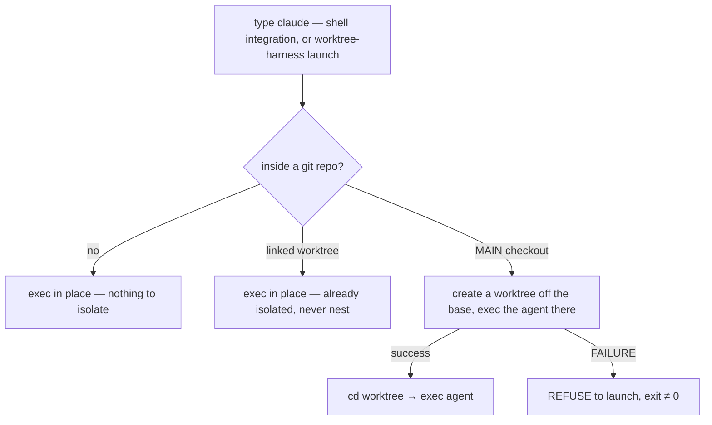
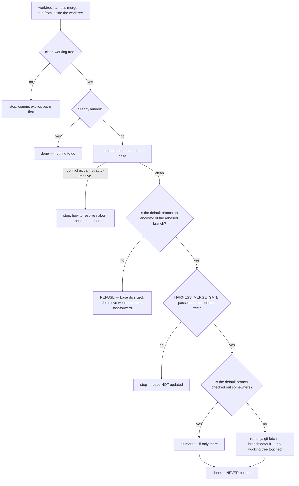

# Design

`worktree-harness` follows from one structural fact — a git worktree has its own
index, HEAD, and reflog — and the disciplines that fact makes possible: no lock,
isolate-or-refuse, fast-forward-only landing behind a gate, an explicit base, and
conservative cleanup. This document is the *why* behind each — the parts worth
understanding before you trust a tool to move your branches around.

## The whole design follows from one structural fact: each worktree has its own index

Run several coding agents on a single checkout and they share **one git index**.
The moment one session stages with `git add -A` (or an agent commits "all
changes"), it can sweep up another session's half-written work into its own
commit. They also fight over dev/inspector ports. People reach for a lock file,
a daemon, or a "only one agent at a time" rule.

None of that is necessary. `git worktree` gives every working tree **its own
index, its own HEAD, and its own reflog**, all backed by the one shared object
store. So:

> The staged-file collision isn't *prevented* by coordination — it's
> *impossible*. There is no shared staging area to collide on.

That's the whole foundation. Each session gets a worktree; isolation is
structural, not cooperative.

```
 you, in N panes (each: `claude`, or `worktree-harness launch claude`)
 ┌───────────┬───────────┬───────────┐
 │  pane 1   │  pane 2   │  pane 3   │
 └─────┬─────┴─────┬─────┴─────┬─────┘
       │           │           │   from the MAIN checkout (.git is a dir) → isolate
       ▼           ▼           ▼
 ┌───────────┬───────────┬───────────┐
 │  wt: A    │  wt: B    │  wt: C    │  separate working tree
 │ branch A  │ branch B  │ branch C  │  separate index / HEAD / reflog
 │ base:main │ base:main │ base:main │  each branched off the base at creation
 │ own ports │ own ports │ own ports │  .env copied, deps installed, .harness.env
 └─────┬─────┴─────┬─────┴─────┬─────┘
       └───────────┼───────────┘
                   ▼
        one shared  <repo>/.git   (objects + refs; content-addressed, atomic)
        refs/heads/{ main, A, B, C }
```

## No lock is needed — the only shared mutable state is refs, which git already serializes

A lock exists to serialize access to a shared mutable resource. After worktrees,
the only shared mutable thing is `refs/heads/*` — and git already serializes ref
updates with a per-ref `.lock` held for microseconds. The working trees and
indexes, the thing a lock would protect, are no longer shared.

So `worktree-harness` ships **no lock and no daemon**. An earlier iteration of
this idea (in the project it was extracted from) carried a session-long writer
lock; it turned out to be a pure DX regression — it blocked other sessions for
no safety benefit, because the worktrees had *already* removed the collision it
was guarding. Deleting it was the fix.

What still needs ordering is **landing** branches — and that's handled by
fast-forward-only discipline plus git's own ref lock, not a tool-level lock (see
below).

## `launch` isolates before it runs your agent — or refuses, never silently falling back



The last branch matters. If creating the worktree fails, the launcher does
**not** quietly run the agent on the main checkout — it exits non-zero and tells
you to fix it (or set `WH_ISOLATION_SKIP=1` to opt out explicitly).

This is the **fail-open lesson**, learned the hard way: a guard that silently
does nothing when it can't do its job is worse than no guard, because you *think*
you're protected. A `PreToolUse`-style hook that errors and is ignored "fails
open" — it lets the unsafe thing through. So isolation here **fails closed**: no
worktree, no launch.

## `merge` lands fast-forward-only, behind your gate, and never pushes

Landing a branch is where the real damage happens — a non-fast-forward clobber,
a stale-remote push, a "looks merged but didn't typecheck" regression. `merge`
makes the boring, safe move in one command (the base is `origin/<default>` when
`HARNESS_BASE_POLICY=origin`, else your local `<default>`):



Three deliberate properties:

1. **Fast-forward only.** The branch is rebased onto the base first, then an
   ancestry check confirms the move is a true fast-forward before anything is
   touched. A diverged base is refused loudly, not forced.
2. **Gated.** A clean *textual* rebase can still be *semantically* broken.
   `HARNESS_MERGE_GATE` (your typecheck/test command) runs on the rebased tree
   before the default branch moves — catching breakage a merge would otherwise
   hide.
3. **Never pushes.** Landing is local. Pushing is a separate, explicit decision.
   This is a direct response to a real footgun in a popular alternative, whose
   "checkout" key auto-pushes to the remote (claude-squad
   [#122](https://github.com/smtg-ai/claude-squad/issues/122)) — dangerous when
   your origin is stale.

Concurrent merge-backs serialize naturally: each is a fast-forward of one ref,
and git's per-ref lock orders them in microseconds. A non-fast-forward is
rejected, so a race can never clobber — the loser just re-rebases and retries.

## Base policy is explicit because "origin is canonical" is wrong for solo and diverged-fork workflows

Most repos: `origin/main` is the truth, you branch off it, you push back. That's
the default (`HARNESS_BASE_POLICY=origin`): fetch, branch off `origin/<default>`,
rebase onto it at merge time.

But some workflows invert this — a solo developer (or a fork that has diverged
far from upstream) where the **local** default branch is canonical and `origin`
is stale or rarely pushed. There, fetching and basing on `origin` is exactly
wrong: you'd branch off outdated code. Native `claude -w` assumes origin is
canonical and even silently no-ops on non-GitHub remotes
([#27947](https://github.com/anthropics/claude-code/issues/27947)).

`HARNESS_BASE_POLICY=local` makes the local default branch the base, never
touching the network. It's a first-class option precisely because the
origin-canonical assumption, baked in everywhere else, is wrong for this case.

## `gc` keeps anything it isn't certain is disposable

`gc` removes a worktree only if it passes **every** gate — clean tree, fully
merged into the default branch, not busy, not open by a live process, and idle
longer than `HARNESS_GC_IDLE_MIN`. Anything else is **kept**, with a printed
reason. **Branches are always preserved** (delete merged ones yourself with
`git branch -d`). The default is a dry-run; `--prune` actually removes.

The bias is intentional: the cost of keeping a worktree too long is a little
disk; the cost of reaping one with unmerged or in-flight work is lost work.

## Structural isolation covers staging collisions, not semantic collisions in shared derived state

Separate indexes prevent *staging* collisions. They do **not** prevent
*semantic* collisions in **shared derived state** — artifacts two worktrees both
generate from a shared counter or registry. The canonical example: a database
migration framework whose journal indexes monotonically. Two worktrees that each
generate "migration 0042" produce a real conflict.

This is not silent corruption. It surfaces where it should — as a merge conflict
in the journal file, or as a failed pre-commit/merge gate in the lagging
session. The remedy is ordinary: rebase and regenerate. The operational rule is
simply *don't run two schema-generating (or lockfile-regenerating) sessions at
the exact same moment*, and let the gate catch it if you do.

`worktree-harness` keeps its own generated file (`.harness.env`) out of this
entirely by registering it in the repo's local `.git/info/exclude`, so it never
trips the clean-tree or dirty gates.

## Non-goals: what `worktree-harness` deliberately is not

- **Not a TUI/GUI.** It's a set of composable shell commands with clean exit
  codes — wire it into scripts, hooks, and CI. For watching many agents
  visually, use a tool built for that.
- **Not an agent multiplexer.** It doesn't broadcast prompts or auto-approve
  tool calls. It manages worktree *lifecycle*; what runs inside is your agent.
- **Not a push/PR tool.** It lands locally and stops. Your `git push` / PR flow
  is unchanged and explicit.
- **No new runtime dependencies, ever.** git + bash. That constraint is the
  product.
